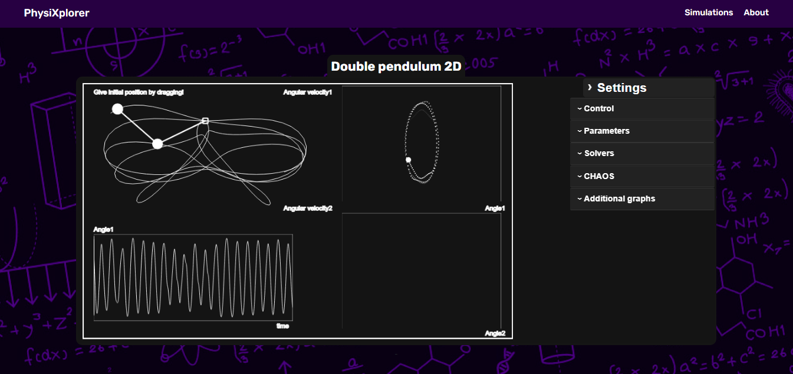
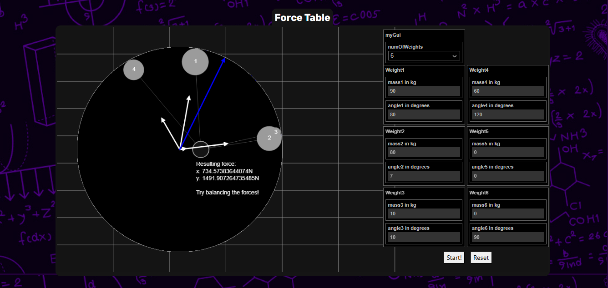
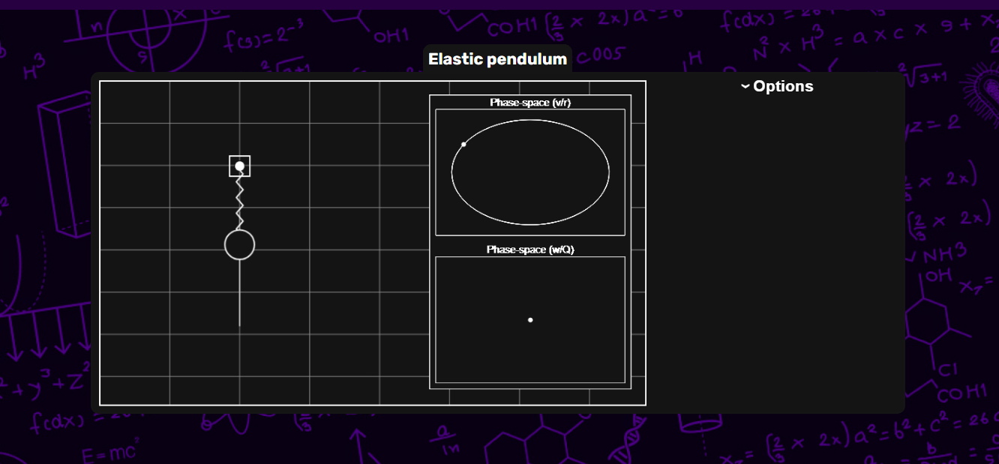
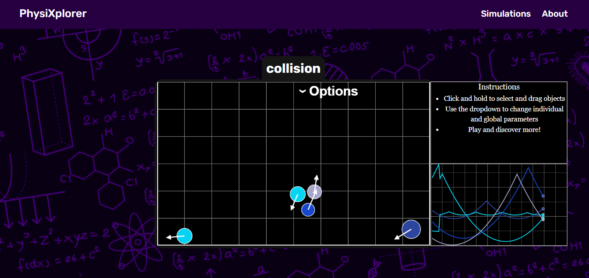
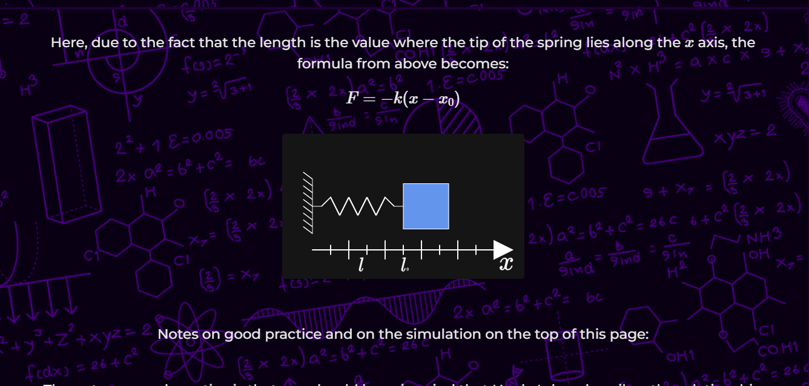

# PhysiXplorer - Explore the Fun Side of Physics!

Welcome to **PhysiXplorer**, the ultimate playground for physics enthusiasts, where you can explore a world of **interactive, fun, and educational physics simulations**! Whether you're a student, teacher, or just a curious mind, PhysiXplorer makes understanding complex physics concepts both **engaging** and **easy to grasp**. Get ready to dive into the universe of motion, forces, energy, and much more – in a way that's never been more fun! 🌟

## 🚀 What's PhysiXplorer?

PhysiXplorer is an **open-source project** designed to provide high school and university students with interactive, easy-to-understand physics simulations. Built with the latest web technologies, PhysiXplorer lets you explore various physics phenomena through **interactive animations** that you control. It's all about **learning by doing**, and every simulation is designed to let you visualize the physics behind it. 

From **simple pendulums** to **electric circuits**, our simulations are created using the powerful **p5.js** library, and we encourage everyone to contribute, no matter if you're a physics expert or just starting. Ready to **explore**, **experiment**, and **learn**? Let's go!

## 🎮 Features

- **Interactive Simulations:** Play around with simulations on topics like motion, waves, energy, and more!
- **Customizable Parameters:** Tweak variables and see real-time changes in the simulation. You control the experiment!
- **Educational Theories:** Each simulation comes with an accompanying **theory section**, explaining the underlying physics and math in a fun, digestible format. 
- **Easy-to-use Interface:** Clean, intuitive design so that you can focus on exploring, not figuring out how to use it.

## ⚡ How It Works

### Set Up the Project
PhysiXplorer is built using **ExpressJS**, a fast web framework for Node.js. To get started, simply follow these steps:

1. **Install Node.js** – The project is built with Node.js, and npm (Node Package Manager) will take care of the dependencies.
2. **Run the Setup** – In the terminal, run `npm install` to install all the required node modules.

### Adding a New Simulation
Have a cool physics simulation in mind? We made it super easy to contribute your own:

1. **Add your p5.js simulation**: Drop your code in the `/public/javascripts/` folder.
2. **Provide Simulation Data**: Update the `/routes/parameters/simulationdata.js` with your new simulation's data.
3. **Run the Python Script**: Run the `python addSimulation.py` script to add your simulation to the site.

Don't worry – if you're not sure where to start, we've got **tutorials** and **starter examples** like the **simplePendulum.js** simulation that you can fork and build upon!

## 🔥 Theming and UI

We’ve designed the site with simplicity and clarity in mind. The UI ensures that all the important controls, like **sliders, buttons, and dropdowns**, are easily accessible, but only when you need them. The simulation window and theory section are organized neatly to ensure a clean learning experience.

### Customization is Key
Every simulation has its own customizable settings. Want to change the mass of the pendulum or the length of the string? It's just a few clicks away! Each setting allows you to change the physics in real time and understand how different parameters affect the system.

## 🌍 Why Contribute?

We believe that the more minds working together, the better we can make **PhysiXplorer**. Here's why you should join us:

- **Open-Source:** Whether you're a seasoned developer or a beginner, your contribution is always welcome.
- **Learning by Doing:** Adding your own simulation is a great way to learn and share your knowledge.
- **Educational Impact:** Your contributions help others better understand the fascinating world of physics.

Ready to make an impact? **Fork the repo**, create your own simulation, and be part of the **PhysiXplorer community**!

## 🚀 Let's Explore the Universe Together!

We’re always looking for new contributors who are passionate about physics and want to make learning even more exciting! If you love experimenting and building new things, **PhysiXplorer** is the perfect place for you. 

Join us in revolutionizing how physics is taught and experienced! 🎓👨‍🔬👩‍🔬

Start exploring: [PhysiXplorer Website](https://physixplorer.vercel.app/)

---

Happy experimenting, and let’s make physics FUN again! ✨
